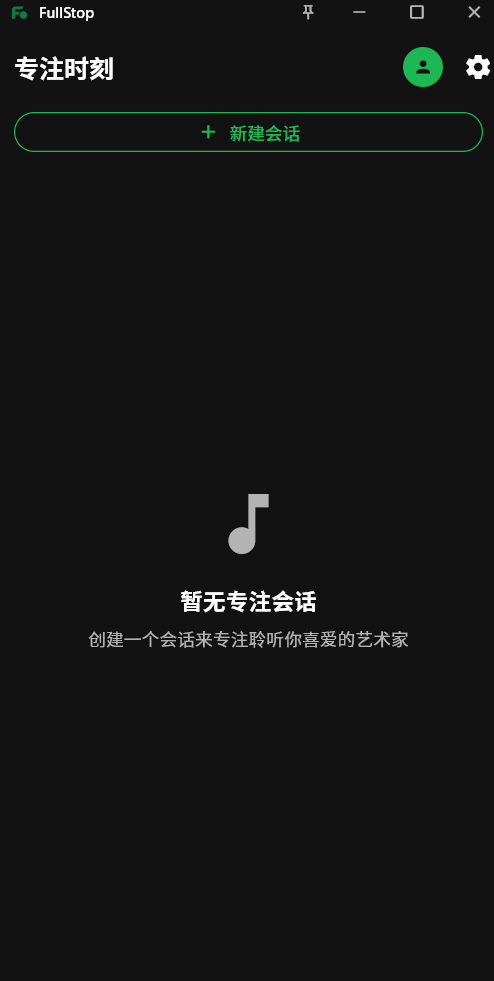
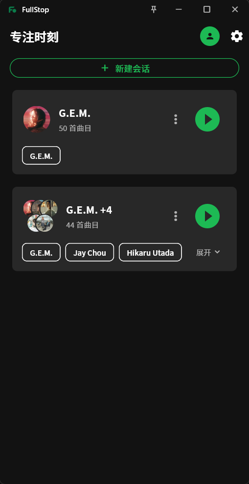
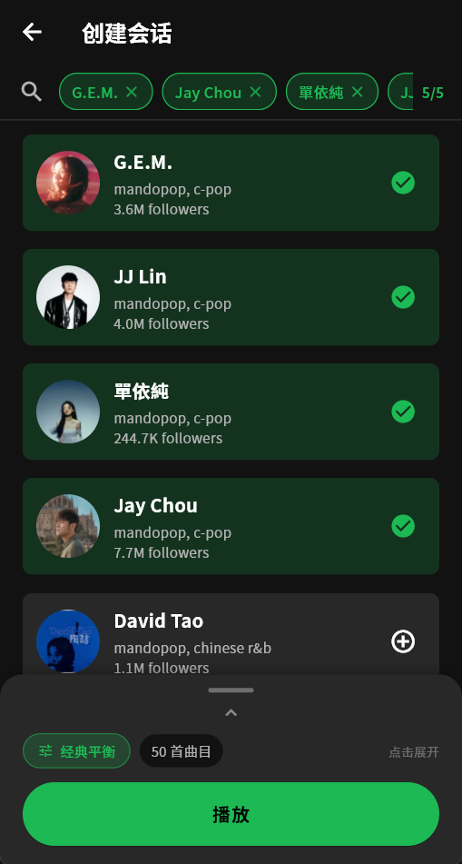
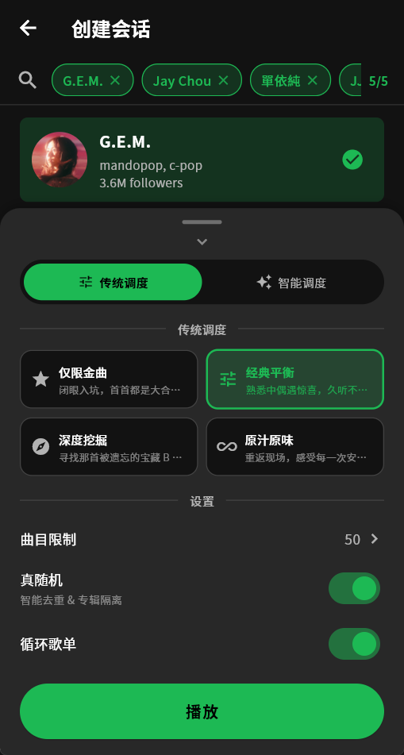

# FullStop.

**Spotify Focus Someone.**

> "Sometimes we need to 'Focus Someone' when listening to music. The same goes for feelings."

[中文](README.md) | English | [日本語](README_ja.md)

---

I use Spotify for its excellent recommendation system, but sometimes I don't need it to be that clever. I don't need an algorithm telling me what I "might like"—I just want to focus on what I've "already chosen."

**FullStop** was born from this need. The name comes from G.E.M.'s song "Full Stop" (句号), and the app itself was conceived while wanting to loop G.E.M.'s playlist endlessly.

We want to put a perfect full stop to all the noisy distractions, leaving only pure music behind.

---

## Your Music, Your Rules

Open FullStop, and you'll see a clean main interface. No flashy recommendation cards, no "You Might Like"—just the personalized radio station you're about to create.

  
  

### Create a Focus Session

We've removed all unnecessary hassles—including "naming your playlist."

Click Create and start right away. FullStop will automatically tag your session with your chosen artists (e.g., "G.E.M. Session"). If this musical journey leaves a lasting impression, you can always give it a special name while playing or after you're done.

No more wasting brain cells—just wake up your ears.

### Choose Your Artists

Search and select the artists you want to focus on. You can pick just one and immerse yourself in Taylor Swift's world all afternoon; or choose a few artists with similar vibes and let G.E.M., Hebe, and Jolin Tsai take turns in your playlist.

Five artists max—just right. Too few gets monotonous, too many loses focus.

  

### Four Listening Moods

This is FullStop's core choice. We don't talk algorithm parameters—we talk about feel and mood:

  

* **Hits Only**
    * **"Close your eyes and dive in—every song's a singalong."**
    * Every track is one you've heard countless times but still want to hear again. When the chorus hits, you're already humming along. Perfect for moments when you need familiarity, like background music while working or singing your heart out on a drive.

* **Balanced**
    * **"Familiar tunes with pleasant surprises—easy listening for hours."**
    * Mostly melodies you know, but occasionally a deep cut pops up—"Wait, this song is actually amazing?" Like catching up with old friends and discovering new topics to chat about—both comfortable and refreshing. This is our recommended default mode.

* **Deep Dive**
    * **"Hunting for that forgotten B-side treasure."**
    * Journey through time, exploring every studio album. Those B-sides overshadowed by hit singles, those treasures only true fans know—they're all here waiting for you. Perfect for alone time, perfect for nights when you want to rediscover an artist.

* **Unfiltered**
    * **"Return to the venue, feel every encore."**
    * Live versions, remixes, acoustic takes—all included. You might discover that a certain song's live version moves you more than the studio recording. That slightly raspy voice, those waves of cheering—warmth you can't find in a studio.

---

## The Invisible Craft

To achieve that "just right" listening experience, we've built a sophisticated audio engine running behind the scenes. You don't need to see it, but you'll hear the difference.

### 1. Full Library Traversal, Not Just "Top 50"
Most tools only fetch an artist's top 50 tracks. But that's far from enough for prolific artists like Jay Chou or G.E.M.
FullStop features a **deep pagination system** that works like a tireless record store owner, flipping through every studio album, scanning 200+ tracks, ensuring no hidden gem is left behind.

### 2. Dynamic Perception Balancing Algorithm
What counts as a "deep cut"? For Hikaru Utada and G.E.M., the definition is completely different.
We've abandoned rigid popularity thresholds in favor of a **dynamic median algorithm**. Whether an artist is a global superstar or an indie darling, FullStop can precisely identify what's hot and what's not *for that specific artist*, dynamically mixing a golden 7:3 ratio.

### 3. Artist Sovereignty
This is the feature we're most proud of. Some songs hold special meaning for their artists.

Taylor Swift spent years re-recording her albums just to reclaim ownership. G.E.M. reinterpreted her classics under the name "Rebirth" (重生) after leaving her former label.
FullStop understands this. When multiple versions of the same song exist, our **weighted scoring system** kicks in:

* ✅ **Prioritized**: Taylor's Version, G.E.M.'s Rebirth versions, and artist re-recordings.
* ❌ **Filtered out**: Those noisy Club Remixes and distracting Sped Up TikTok versions are quietly shown the door.

What you hear is what the artist wants you to hear.

### 4. True Shuffle & Region Awareness
We've implemented a **True Shuffle** algorithm ensuring songs from the same album don't cluster together. Meanwhile, the engine automatically detects your Spotify account's region (Market), guaranteeing every generated song is playable in your area—no more frustrating grayed-out tracks.

---

## Getting Started

### Prerequisites
1. **Spotify Premium** subscription.
2. A Spotify Developer App with `Client ID` and `Secret`.

### Installation (iOS)
1. Download the latest `.ipa` file from [Releases](your-github-releases-link).
2. Install using **AltStore**, **Sideloadly**, or **TrollStore** for self-signing.

---

## Acknowledgments

* [Spotify Web API](https://developer.spotify.com/documentation/web-api/)
* [Flutter](https://flutter.dev)

---

### End

I wish I could watch a flower slowly bloom, while you watch my spirit slowly soar.

**But—**

> "Too much disappointment made my trust in you slowly crumble"
>
> — G.E.M. "Full Stop"
